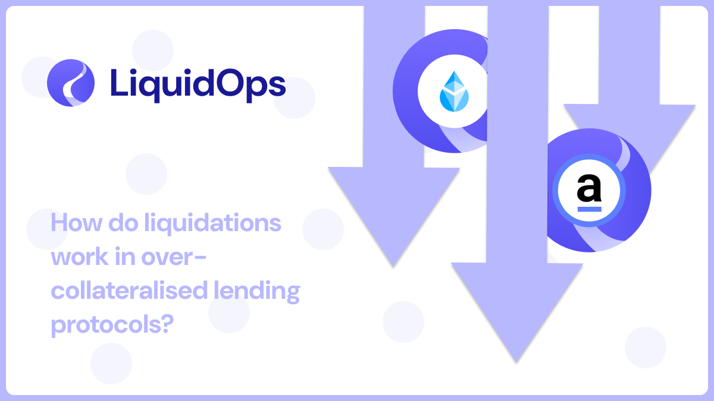

# How do Liquidations Work in Overcollateralized Lending Protocols?

<figure><figcaption></figcaption></figure>

### **Traditional Loans**

If you take out a loan for a house, the house itself will act as its own collateral. Now if you get into debt, the house itself can be seized to recover said debt.

### **Loans in the World of Crypto**

In crypto there are overcollateralized loans. Since you can’t put up your house, you have to give something up in case you get into debt.

This can’t be something that holds the same value as your loan because of the rapid change of price differences between tokens, and also to safeguard the protocol.

### **Overcollateralized Loans**

This means that you pledge more collateral than the amount borrowed. For example, if it has a 200% collateralisation rate, then two times the value of the loan must be pledged as collateral.

This rate is determined by a risk analysis, in LiquidOps case this is to be made on a case-by-case basis by a protocol governance vote. Collateral supplied to LiquidOps is locked, unless either you pay back your loan or the position is liquidated due to bad debt.

### **Liquidation in the Context of Overcollateralized Lending Protocols**

When you take out a loan, the protocol will maintain the collateralisation ratio. If the value of the collateral falls significantly, the loan-to-collateral ratio increases.

To safeguard the protocol, a liquidation ratio is set, typically below the initial collateralization ratio, but above 100%. If the collateral value falls below this ratio, liquidation is triggered.

In the liquidation process, the protocol automatically sells a portion (or all) of your collateral to repay the loan. This often involves offering the collateral at a discount to buyers to acquire it.

Liquidations are essential not only to protect the protocol, but to maintain the ecosystem's DeFi stability.
