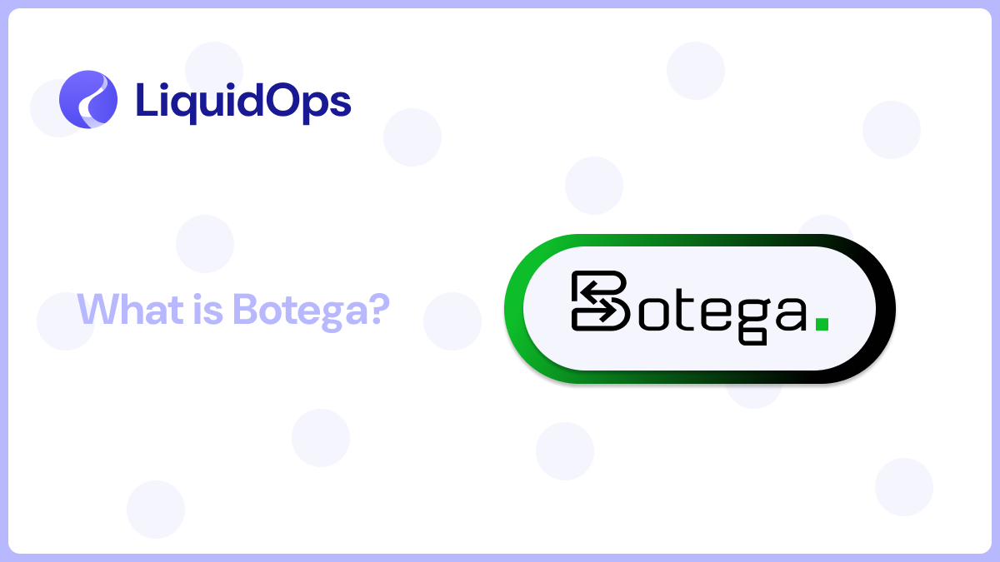

# Project Highlight: Botega

<figure><figcaption></figcaption></figure>

### What is Botega?

Botega is a decentralized exchange (DEX) developed by Autonomous Finance. It is built on AO and is designed to operate without intermediates, using autonomous agents to manage trading and liquidity. It operates in a fully permissionless way, providing a user-friendly trading environment.

Let’s look into its core features and how it works!

### Trading with Autonomous Agents

Botega’s system utilizes autonomous agents to handle trading tasks. These agents process transactions, manage liquidity, and execute trades based on preset rules, making trading more efficient.

### Order Types

Botega supports different types of trades, including:

* **Limit Orders**: Users can set a price at which they want to buy/sell an asset. The trade happens only when the market reaches that price.
* **Dollar-Cost Averaging (DCA)**: Users can set automated periodic purchases to reduce exposure to short-term price volatility.
* **Stop-Loss Orders**: If an asset’s price drops to/below a certain level it gets sold automatically.

### Decentralized and Permanent Platform

Botega’s user interface is hosted on Arweave, meaning it cannot be taken down or altered. Users can access the platform through different AR.IO gateways, like botega.g8way.io and botega.permagate.io.
