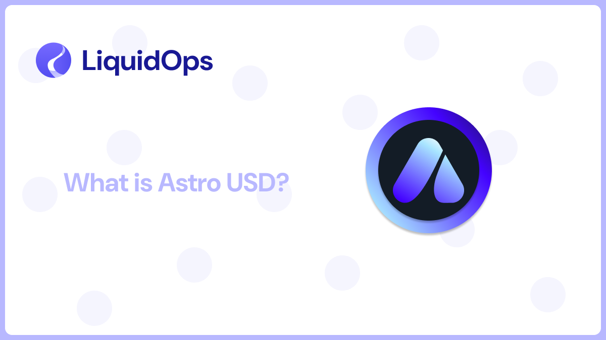

# Project Highlight: Astro

<figure><figcaption></figcaption></figure>

### About Astro

Astro USD (USDA) is an over-collateralized stablecoin designed to work within the AO and Arweave ecosystems. The platform offers multiple DeFi services like bridging, trading, and earning opportunities.

Let’s look into it!

### What does Astro USD do?

It's a decentralized finance (DeFi) platform, that allows users to securely transfer, trade, and earn digital assets across blockchain networks without relying on traditional financial institutions.&#x20;

Its key features include:&#x20;

* **Quantum Bridge**: A secure portal enabling users to bridge assets between Arweave and AO.
* **Defi, Prediction Markets & GameFi**:  The platform enables participation in on-chain prediction markets, decentralized gaming economies (GameFi), and AI-driven financial applications (AgentFi).

### Security and Performance

Astro USD operates within a trustless environment, reducing reliance on intermediaries, and transactions are processed efficiently within the AO ecosystem.&#x20;

Additionally, Arweave’s permanent storage preserves data integrity and transparency by ensuring records cannot be altered or deleted.

### Ecosystem Partnerships

Astro USD collaborates with partners like Community Labs, Protocol.Land, ArConnect, Perplex, Botega, FairAI, Autonomous Finance, Copper.co, BoomFi, CoinMaker, DEXI, and LiquidOps to enhance its infrastructure and user experience.
